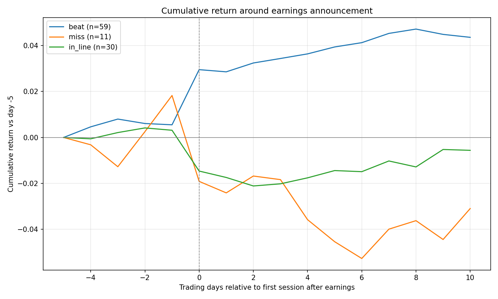
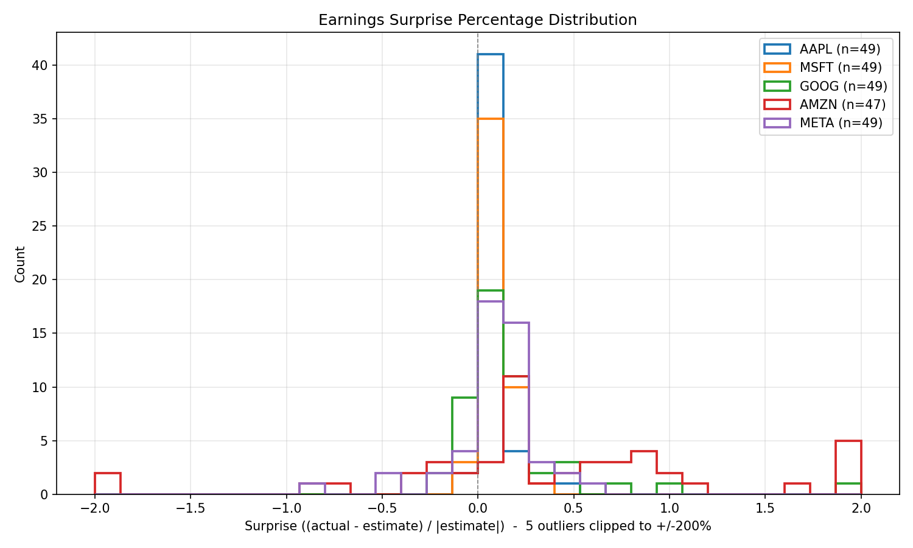

# earning-surprise-analysis

Looks at how US stock prices move when a company's earnings beat or miss what
analysts expected.

Every quarter, companies report their profits. Analysts guess the number ahead
of time. This project measures the gap between the guess and the real number,
then checks what the share price did around that day.

## Results



The chart covers 5 big tech stocks over 5 years, which is 100 earnings reports
(20 each). Day 0 is the first day people can trade on the news.

- Companies that **beat** expectations jump about **+3%** on day 0, then keep
  climbing to about **+4.7%** ten days later.
- Companies that **miss** fall about **−2%**, then keep sliding to about **−5%**.

The interesting part is what happens *after* day 0. The price does not just jump
once and stop. It keeps drifting the same way for days.



One warning about the first chart: there were 59 beats, 30 in-line, but only 11
misses. Big tech usually beats expectations, so the "miss" line is based on very
few reports and jumps around a lot.

## Install

```bash
pip install -r requirements.txt
```

## Run

```bash
python sample_code.py
```

It downloads live data from Yahoo Finance, prints how many reports it found for
each stock, and saves two charts:

| File | What it shows |
| --- | --- |
| `earnings_return_chart.png` | Average price move for beats, misses, and in-line |
| `earnings_surprise_distribution.png` | How big the surprises were, per stock |

## Settings

Change these at the top of `sample_code.py`:

| Setting | Default | What it does |
| --- | --- | --- |
| `TICKERS` | `AAPL, MSFT, GOOG, AMZN, META` | Which stocks to look at |
| `WINDOW_BEFORE` | `5` | Days to show before the report |
| `WINDOW_AFTER` | `10` | Days to show after the report |
| `HISTORY_PERIOD` | `5y` | How far back to get prices |
| `EARNINGS_LIMIT` | `40` | How many reports to ask for |
| `BEAT_THRESHOLD` | `0.05` | How big a gap counts as a beat or miss |

`HISTORY_PERIOD` is what really controls how much data you get. Yahoo has
earnings going back to 2014, but a report is only used if there are enough
price days around it. With `5y` of prices you get 20 reports per stock, even if
you raise `EARNINGS_LIMIT`.

## How it works

**Picking day 0.** Most of these companies report at 4pm, after the market
closes. So nobody can react until the next morning. Day 0 is that next trading
day, not the day of the report itself. Getting this wrong splits the price jump
across two days and makes the chart look flatter than it is.

**Measuring the surprise.** The formula is
`(real number − expected number) / |expected number|`. The `| |` bars mean
"ignore the minus sign". This matters when analysts expect a loss. If they
expect −0.10 and the company reports −0.05, that is good news. Without the bars,
the maths turns it into a negative and the script would file it as bad news.
Reports where the expected number is zero are skipped, because you cannot divide
by zero.

**Measuring the move.** Prices are compared to the closing price 5 days before
the report, so every line starts at zero on the left. Prices are adjusted for
stock splits and dividends.

**Handling extreme values.** When analysts expect a profit near zero, even a
tiny difference looks like a surprise of several hundred percent. The
distribution chart cuts off the most extreme 4% so the rest is readable, and
says how many points it cut. The main chart uses everything.

**Yahoo data quirks.** The column holding the real EPS number has been renamed
between versions of `yfinance`. It is `Reported EPS` now and was `EPS Actual`
before, so the script checks for both instead of assuming one. Earnings dates
also come with a New York timezone attached while daily prices come without one,
so the script strips it off before comparing them.

## Limits of this analysis

This is a study, not a trading strategy, and not financial advice.

- Only 5 stocks, all big tech, all over the same 5 good years. They tend to move
  together, so this is a smaller sample than 100 reports sounds like.
- The returns are raw. Nothing is subtracted for how the wider market moved over
  the same days, so some of the drift is just the market going up.
- Trading costs are ignored.
- Yahoo Finance data is free, and it sometimes changes or drops old estimates.

## Requirements

Python 3.9 or newer, plus the packages in `requirements.txt` (yfinance, pandas,
numpy, matplotlib, statsmodels). These have no version numbers pinned, and
`yfinance` changes things between releases, so an update can break the script.

## License

MIT — see [LICENSE](LICENSE).
